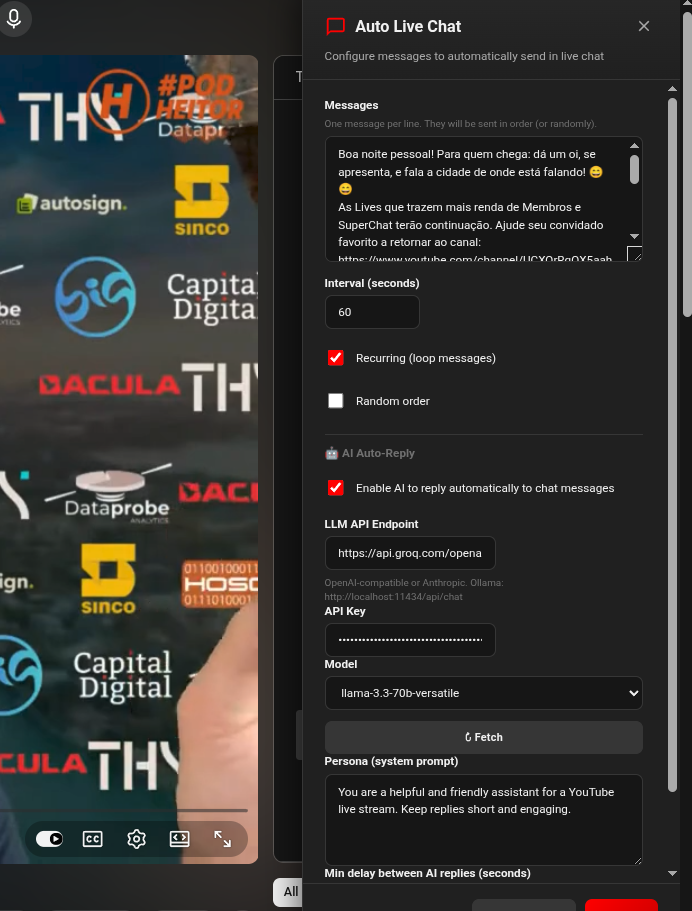
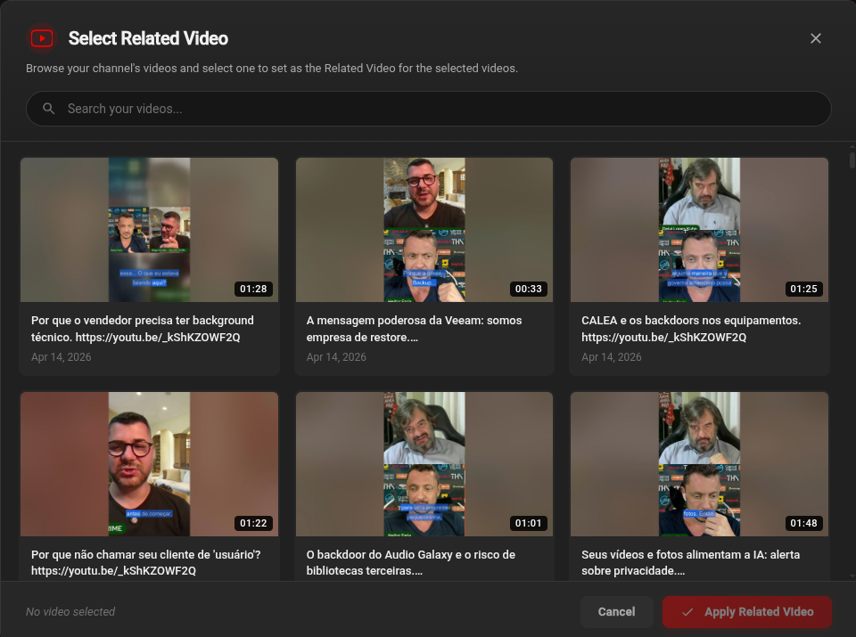
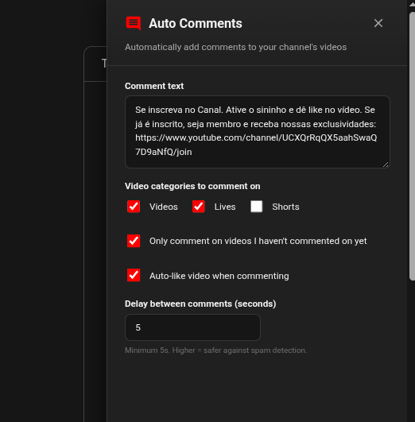

# PHYAT — PodHeitor YouTube Automation Tools

> Chrome/Brave extension with automation tools for YouTube creators.  
> No API keys, no Google Cloud setup — works with your existing YouTube session.

---

## Screenshots

<p align="center">
  
  
  
</p>

---

## Features

### 🔗 Bulk Related Video
Set the "Related Video" field on multiple YouTube Studio videos at once.

| Detail | Info |
|--------|------|
| **Where** | YouTube Studio → Content → Videos |
| **How** | Select videos with checkboxes → click red FAB → pick related video |
| **Scope** | Applied to all selected videos in one go |

---

### 💬 Auto Live Chat Messages
Send pre-configured messages in YouTube live chat on a schedule.

| Detail | Info |
|--------|------|
| **Where** | YouTube → any live stream watch page |
| **Button** | Red FAB (right side, upper position) — visible on live streams |

**Options:**
- Messages: one per line, supports unlimited entries
- Interval: 10 s to 1 h between sends
- Recurring: loop through all messages continuously
- Random order: shuffle message sequence each loop

---

### 🤖 AI Auto-Reply (Live Chat)
Automatically reply to viewer messages using any LLM API.

| Detail | Info |
|--------|------|
| **Toggle** | "Enable AI to reply automatically to chat messages" |
| **Requires** | API access to an OpenAI-compatible, Anthropic, or Ollama endpoint |

**Supported APIs:**

| Provider | Endpoint | Model example |
|----------|----------|---------------|
| **Groq** (recommended — fast, free tier) | `https://api.groq.com/openai/v1/chat/completions` | `llama-3.3-70b-versatile` |
| **OpenAI** | `https://api.openai.com/v1/chat/completions` | `gpt-4o-mini` |
| **Anthropic (Claude)** | `https://api.anthropic.com/v1/messages` | `claude-haiku-4-5` |
| **Ollama (local)** | `http://localhost:11434/api/chat` | `llama3`, `mistral` |

**Config fields:**
- **LLM API Endpoint** — full URL to the chat completions endpoint
- **API Key** — `gsk_...` for Groq, `sk-...` for OpenAI, `sk-ant-...` for Anthropic, empty for Ollama
- **Model** — select from dropdown; click **↻ Fetch available models** to populate from your API
- **Persona** — system prompt that defines the AI's personality and context
- **Min delay** — minimum seconds between AI replies (prevent rate-limit / spam, default 30 s)
- **🧪 Test API** — quick connection test; shows green ✓ with a sample reply if OK

**How it works:**
- Watches for new messages via `MutationObserver` on the live chat DOM
- Feeds last 10 conversation turns as context to the LLM
- Can run simultaneously with the pre-written message loop

---

### 📝 Auto Comments
Automatically add comments to every video on your channel.

| Detail | Info |
|--------|------|
| **Where** | YouTube → Home page (youtube.com) |
| **Button** | Red FAB (right side, lower position) |

**Options:**
- **Content types:** Videos, Live streams, Shorts (select any combination)
- **Only uncommented:** Skip videos that already have your comment
- **Auto-like:** Like the video before commenting
- **Delay:** Configurable seconds between each comment
- **Pagination:** Fetches all videos via YouTube's continuation API (up to ~1,440 per session)
- **Stop button:** Cancel the run at any time from the progress overlay

**How it works:**
1. Fetches all videos from your channel using YouTube's internal Browse API
2. Saves the task list to `chrome.storage.local` — survives page navigations
3. Navigates to each video, posts the comment, then proceeds to the next
4. Progress is shown in a non-blocking overlay with live counter

---

## Installation

1. Clone or download this repository  
2. Open `chrome://extensions` in Chrome or Brave  
3. Enable **Developer mode** (top-right toggle)  
4. Click **Load unpacked** → select this folder  
5. Navigate to YouTube or YouTube Studio — features activate automatically

> **After updating the extension** (especially if `manifest.json` changed), go to `chrome://extensions`, find PHYAT, and click the refresh ↺ icon.

---

## Project Structure

```
PHYAT/
├── manifest.json           # Extension config (Manifest V3)
├── background.js           # Service worker
├── popup.html / popup.css  # Extension popup — feature overview
├── modal.js                # Video picker modal (Related Video)
├── page_bridge.js          # YouTube Studio internal API bridge
├── styles.css              # All content script styles (shared)
├── core/
│   └── utils.js            # Shared utilities: toast, progress overlay, DOM helpers
├── features/
│   ├── related-video/
│   │   └── related-video.js  # Bulk Related Video
│   ├── live-chat/
│   │   └── live-chat.js      # Auto Live Chat + AI Auto-Reply
│   └── auto-comments/
│       └── auto-comments.js  # Auto Comments (persistent task architecture)
├── docs/
│   └── screenshots/          # UI screenshots
└── icons/
    ├── icon16.png
    ├── icon48.png
    └── icon128.png
```

---

## Permissions

| Permission | Reason |
|-----------|--------|
| `https://www.youtube.com/*` | Live Chat, Auto Comments |
| `https://studio.youtube.com/*` | Bulk Related Video |
| `http://localhost/*`, `http://127.0.0.1/*` | Local LLM (Ollama) |
| `https://*/*` | External LLM APIs (OpenAI, Groq, Anthropic, etc.) |
| `storage` | Persist config and task state across page navigations |
| `scripting` | Inject content scripts dynamically |

---

## Author

**Heitor Faria** — [youtube.com/@PodHeitor](https://www.youtube.com/@PodHeitor)

## License

GNU General Public License v3.0 — see [LICENSE](LICENSE) for details.
